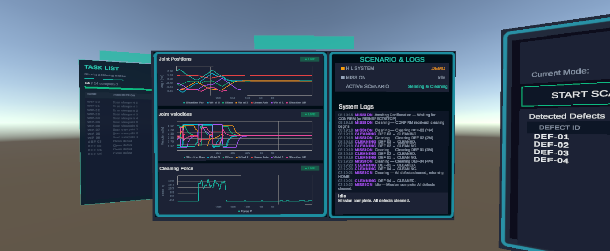
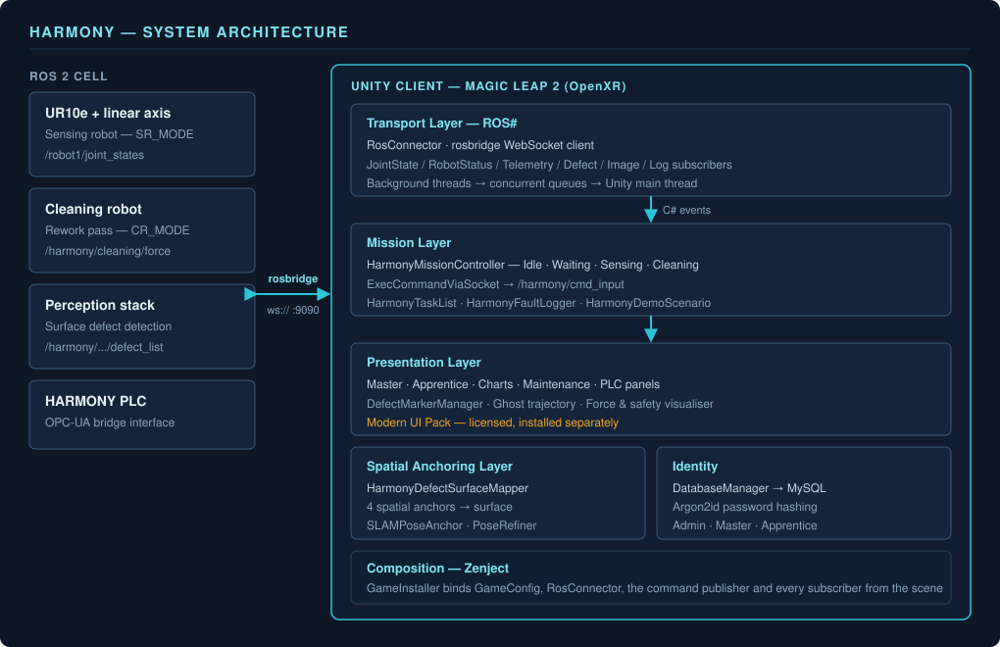
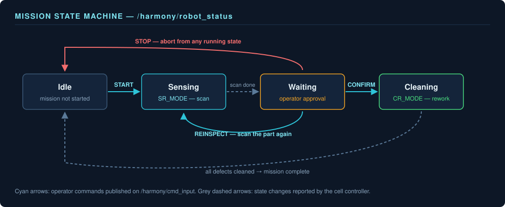
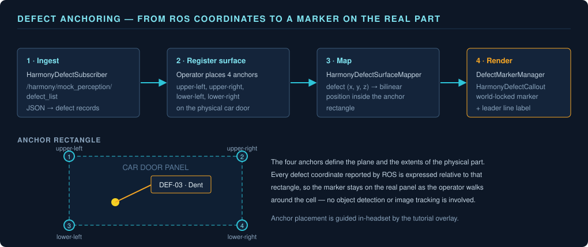
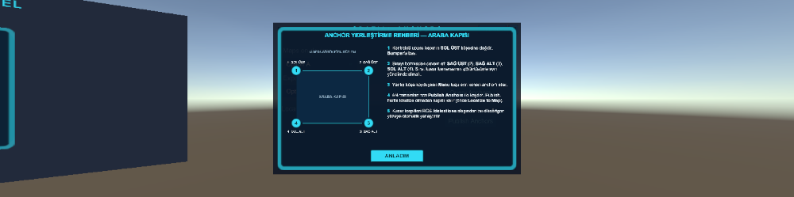
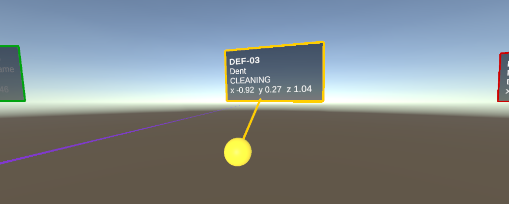
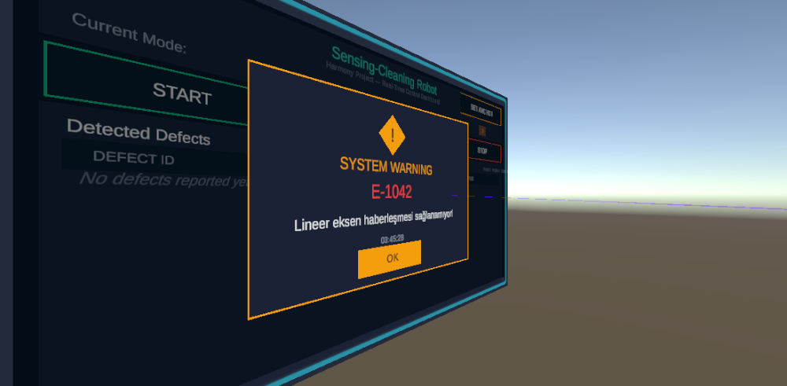

# HARMONY
## HUMAN-AUGMENTED REALITY MONITORING FOR OPERATOR NAVIGATION AND YIELD

HARMONY is a Unity-based mixed reality operator interface developed by Lider Teknoloji Gelistirme Ltd. Sti. for industrial human–robot collaboration cells. It places a live, spatially registered view of a dual-robot inspection and rework cell in front of the operator: the sensing robot scans a car door for surface defects, the detected defects are anchored onto the physical part in world space, and the operator approves, rejects or re-runs the cleaning pass from an AR panel. The application targets the Magic Leap 2 headset through OpenXR and communicates with the ROS 2 cell controller over `rosbridge`.


*The operator workspace in Sensing & Cleaning mode: task list, live joint/force charts, scenario log and the detected-defect table, all rendered as world-space panels around the operator.*

---

## Software Description

HARMONY provides an end-to-end operator loop, from ROS 2 telemetry ingestion to spatially anchored defect visualisation inside the headset. The platform supports:

- Live ROS 2 telemetry over `rosbridge` WebSocket (joint states, robot status, trajectory events, contact force, `/rosout`)
- Mission state machine mirroring the cell controller (`Idle → Waiting → Sensing → Cleaning`)
- Operator command publishing (`START`, `CONFIRM`, `REINSPECT`, `STOP`) to `/harmony/cmd_input`
- Defect ingestion from the perception stack and projection onto a physical surface defined by four spatial anchors
- Forward kinematics for the UR10e + linear-axis assembly, with ghost trajectory preview and force/safety visualisation
- Role-based login (Admin / Master / Apprentice) against MySQL with Argon2id password hashing
- A hardware-free **DEMO GUI** mode that replays the whole flow from synthetic data, with no ROS 2 connection
- Guided maintenance scenarios and a PLC control panel mirroring the HARMONY PLC Control System HMI

## Technical Features

**Built with Unity 6**: HARMONY is built on Unity **6000.3.10f1** with the Universal Render Pipeline (17.3.0) and OpenXR (1.16.1), targeting Android-based standalone headsets as well as the in-editor XR Simulation loader for deskside development.

**Magic Leap 2 via OpenXR**: The project runs on the Magic Leap 2 OpenXR feature groups (`com.magicleap.openxr.featuregroup`) — planes, spatial anchors and marker tracking — with the Magic Leap Unity SDK supplying the platform APIs. XR Hands (1.7.3) and the XR Interaction Toolkit (3.3.1) provide hand tracking and interaction.

**ROS 2 Integration via ROS#**: All cell communication goes through the Siemens ROS# `rosbridge` client. Subscribers run on background threads and marshal messages into concurrent queues consumed on the Unity main thread, so a slow or disconnected bridge never stalls rendering.

**Spatially Anchored Defect Mapping**: `HarmonyDefectSurfaceMapper` takes defect coordinates published by the perception stack and maps them onto the rectangle defined by four spatial anchors placed on the physical part, so a marker stays on the real door panel as the operator walks around the cell.

**Managed-Only Pose Refinement**: `EdgeProcessor` implements Sobel edge detection in pure C# and `PoseRefiner` runs Levenberg–Marquardt / Gauss–Newton iterative pose refinement against CAD edges. Both are managed code, so the build carries no native image-processing libraries.

**Dependency Injection with Zenject**: `GameInstaller` binds the ROS connector, the command publisher and every subscriber from the scene hierarchy, so panels receive their data sources by injection rather than by `FindObjectOfType` lookups.

**Demo Mode for Hardware-Free Operation**: `HarmonyDemoScenario` drives the complete mission flow — scan, defect list, operator confirmation, cleaning pass, fault injection — from synthetic data. This makes the application demonstrable without the robot cell, the ROS 2 stack or the headset cameras.

**Modern UI Pack Interface**: Every panel, button, modal window and HUD element is built on the Modern UI Pack asset (see [Modern UI Pack](#3-modern-ui-pack-required-asset-store-package)). The package is **not** included in this repository for licensing reasons and must be installed separately.

---

## System Architecture

HARMONY separates the ROS transport layer, the mission layer and the presentation layer. Subscribers own no UI, panels own no networking, and the mission controller is the only component that both reads status and publishes commands.



### Key System Components

| Component | Responsibility | Technology |
|-----------|---------------|------------|
| **HarmonyMissionController** | Mission state machine; parses `/harmony/robot_status`, dispatches state events to panels | ROS# + Zenject + Newtonsoft.Json |
| **ExecCommandViaSocket** | Advertises and publishes operator commands on `/harmony/cmd_input` | ROS# `RosSocket` |
| **HarmonyDefectSubscriber** | Receives single defects and defect lists from the perception stack | ROS# subscriber |
| **HarmonyDefectSurfaceMapper** | Projects defect coordinates onto the anchor-defined physical surface | XR Anchors + custom mapping |
| **PoseRefiner / EdgeProcessor** | CAD-edge pose refinement without native dependencies | Pure C# LM / Gauss–Newton, Sobel |
| **HarmonyRobotKinematics** | Forward kinematics for UR10e + linear axis (Denavit–Hartenberg) | `Ur10eForwardKinematics` |
| **HarmonyGhostTrajectory** | Renders the upcoming TCP path as a ghost line in the AR scene | Unity LineRenderer |
| **TrajectoryForceSafetyVisualizer** | Colour-codes the trajectory by contact force and safety margin | `/harmony/cleaning/force` |
| **HarmonyDemoScenario** | Replays the complete mission from synthetic data, no ROS required | C# coroutines |
| **DatabaseManager** | Login, registration and role management | MySqlConnector + Argon2id |
| **GameInstaller** | Binds config, ROS connector, publisher and all subscribers | Zenject `MonoInstaller` |

---

## ROS 2 Interface

The Unity client connects to `rosbridge` (default `ws://<cell-ip>:9090`, configured on the `RosConnector` component in the scene).

### Subscribed Topics

| Topic | Message | Consumer | Purpose |
|-------|---------|----------|---------|
| `/harmony/robot_status` | `std_msgs/String` (JSON) | `HarmonyMissionController`, `RobotStatusSubscriber` | Mission state and operator instruction text |
| `/harmony/mock_perception/defect` | `std_msgs/String` (JSON) | `HarmonyDefectSubscriber` | Single detected defect |
| `/harmony/mock_perception/defect_list` | `std_msgs/String` (JSON) | `HarmonyDefectSubscriber` | Full defect table for the current scan |
| `/harmony/defect_status` | `std_msgs/String` | `HarmonyDefectSubscriber` | Per-defect rework status |
| `/harmony/cleaning/force` | `std_msgs/Float32` | `HarmonyTelemetrySubscriber` | Contact force during the cleaning pass |
| `/joint_states` | `sensor_msgs/JointState` | `HarmonyTelemetrySubscriber`, `RobotSpecsSubscriber` | Cell-wide joint telemetry |
| `/robot1/joint_states` | `sensor_msgs/JointState` | `JointStateSubscriber`, `JointSliderSubscriber`, `JointDetailSubscriber` | Per-robot joint angles for the digital twin |
| `/robot1/robot1_scaled_joint_trajectory_controller/state` | `control_msgs/JointTrajectoryControllerState` | `ControllerStateSubscriber` | Controller error and setpoint tracking |
| `/robot1/trajectory_execution_event` | `std_msgs/String` | `TrajectoryEventSubscriber` | Trajectory start / abort / success events |
| `/image_robot1`, `/image_robot2` | `sensor_msgs/CompressedImage` | `ImageSubscriber` | Camera streams shown on the AR panels |
| `/ros2_comm/speed` | `std_msgs/Float32` | `SpeedSubscriber` | Commanded cell speed |
| `/rosout` | `rcl_interfaces/Log` | `RosLogSubscriber` | Live ROS log feed inside the headset |

### Published Topics

| Topic | Message | Publisher | Payload |
|-------|---------|-----------|---------|
| `/harmony/cmd_input` | `std_msgs/String` (JSON) | `ExecCommandViaSocket` | One of `START`, `CONFIRM`, `REINSPECT`, `STOP` |

### Mission State Machine

`HarmonyMissionController` mirrors the `state` field published on `/harmony/robot_status`:



| State | Meaning | Typical operator action |
|-------|---------|------------------------|
| `Idle` | Mission not started | `START` |
| `Waiting` | Cell waiting for operator approval | `CONFIRM` or `REINSPECT` |
| `Sensing` | Sensing robot scanning the part (`SR_MODE`) | Observe; `STOP` to abort |
| `Cleaning` | Cleaning robot reworking defects (`CR_MODE`) | Observe; `STOP` to abort |
| `Unknown` | Unrecognised status string received | Check the cell controller |

---

## Defect Anchoring

Defect positions are not derived from on-device image analysis. The cell's perception stack publishes defect coordinates over ROS, and the Unity client registers those coordinates against the physical part using four spatial anchors that the operator places on the door panel. Everything downstream — markers, callouts, the defect table — is driven from that anchor rectangle.



### Placing the anchors

An in-headset overlay walks the operator through the four anchor positions in a fixed order (upper-left, upper-right, lower-left, lower-right). The mission cannot report meaningful world positions until all four are set.



### Reading a defect

Each defect is drawn as a world-locked marker with a leader line to its callout, showing the defect ID, its type and its position in the cell frame. The callout follows the operator's viewpoint while the marker stays on the panel.



---

## Operator Interface

### Mode Selection

On start-up `HarmonyModeSelector` shows a world-space dialog in front of the operator with three choices:

| Mode | Behaviour |
|------|-----------|
| **DEMO GUI** | `HarmonyDemoScenario` is enabled; the entire mission is replayed from synthetic data with no ROS 2 connection |
| **ROS2 GUI** | Normal operation; all subscribers bind to the live `rosbridge` connection |
| **Maintenance** | Opens `HarmonyMaintenancePanel` with the step-by-step Doosan maintenance scenarios |

The dialog is placed 1.1 m in front of the user at a configurable vertical offset and stays until a choice is made.

### Panels

| Panel | Script | Contents |
|-------|--------|----------|
| Master panel | `HarmonyMasterPanel` | Mission state, defect table, command bar, robot telemetry |
| Apprentice panel | `HarmonyApprenticePanel` | Simplified command bar and scenario status indicators |
| Charts panel | `HarmonyChartsPanel` | Three live charts mirroring the web HMI's Chart.js views |
| Robot specs panel | `HarmonyRobotSpecsPanel` | Joint limits, payload and reach read from telemetry |
| Maintenance panel | `HarmonyMaintenancePanel` | Guided, step-by-step maintenance procedures |
| PLC control panel | `PlcControlPanel` | Magic Leap 2 port of the HARMONY PLC Control System HMI |
| Defect panel | `DefectPanelConnector`, `HarmonyDefectCallout` | Per-defect callouts anchored to the physical part |
| XR diagnostics | `HarmonyXrDiagnostics` | Hand-tracking chain diagnostics, readable on-device |

Faults raised by the cell interrupt the operator with a modal warning; `HarmonyFaultLogger` records how long the operator took to acknowledge it.



`PlcControlPanel` reproduces the HARMONY PLC Control System HMI inside the headset, so the operator does not have to walk back to the workstation to toggle sensing and cleaning robot signals.

### Scenes

| Scene | Purpose |
|-------|---------|
| `Assets/Scenes/LoginScreen.unity` | Role-based login and apprentice registration |
| `Assets/Scenes/RobotKontrol (Usta).unity` | Master (Usta) operator scene — full command authority |
| `Assets/Scenes/RobotKontrol (Çırak).unity` | Apprentice (Çırak) scene — restricted command set |
| `Assets/Scenes/Options.unity` | Application settings |
| `Assets/Scenes/SampleScene.unity` | Empty template scene |

---

## Installation

### Prerequisites

- **Unity 6000.3.10f1** (exact version; the project is not tested on other 6.x releases)
- Unity Hub 3.x
- Visual Studio 2022+ or JetBrains Rider (C# IDE)
- Android Build Support module (API 29+) for headset deployment
- A ROS 2 cell exposing `rosbridge_server` on port 9090 — *optional*, DEMO GUI mode runs without it
- A MySQL server for the login flow — *optional*, only required by `LoginScreen.unity`
- **Modern UI Pack** (Unity Asset Store, paid) — required for the entire user interface. Not included in this repository for licensing reasons; see [step 3](#3-modern-ui-pack-required-asset-store-package).

### 1. Clone the Repository

```bash
git clone https://github.com/LiderTeknolojiGelistirme/HARMONY.git
```

### 2. Unity Project Setup

1. Add the folder in Unity Hub and open it with **Unity 6000.3.10f1**.
2. Registry packages listed in `Packages/manifest.json` are resolved automatically on first open.
3. The Magic Leap Unity SDK is resolved from the local archive `Packages/com.magicleap.unitysdk.tgz`, which is committed — no extra download is needed.
4. Install **Modern UI Pack** (step 3) **before** opening any HARMONY scene, otherwise every UI reference resolves as missing.
5. Open `Assets/Scenes/RobotKontrol (Usta).unity` and let Unity finish importing and recompiling.

### 3. Modern UI Pack (required Asset Store package)

The complete HARMONY interface — operator panels, command buttons, modal windows, progress bars and HUD elements — is built on **Modern UI Pack**, a commercial Unity Asset Store package.

| | |
|---|---|
| **Asset** | Modern UI Pack |
| **Publisher** | Michsky |
| **Version used in this project** | **5.5.27** |
| **Store page** | https://assetstore.unity.com/packages/tools/gui/modern-ui-pack-201717 |
| **Documentation** | https://docs.michsky.com/docs/modern-ui-pack/ |
| **Release notes** | https://assetstore.unity.com/packages/tools/gui/modern-ui-pack-201717#releases |
| **Runtime namespace** | `Michsky.MUIP` |
| **Required install path** | `Assets/3rd Party/Modern UI Pack/` |

#### Why it is not in this repository

The Unity Asset Store EULA permits use only of copies obtained through the Asset Store under a valid licence. Redistributing the package through a public Git repository would breach that licence, so it has been removed from the repository **and from its Git history**, and is excluded via `.gitignore`. Every developer must obtain their own licence.

#### Installation steps

1. Purchase Modern UI Pack from the store page above using the Unity account that will be used on the development machine.
2. Open the project in Unity, then **Window → Package Manager**.
3. Switch the package source dropdown from *In Project* to **My Assets**.
4. Search for `Modern UI Pack`, then click **Download** and **Import**.
5. In the import dialog keep **all** items selected and confirm. Unity imports the package into `Assets/Modern UI Pack/`.
6. Move the imported folder to `Assets/3rd Party/Modern UI Pack/` so it matches the path the project documents and the path `.gitignore` excludes. Unity resolves asset references by GUID, so moving the folder does not break prefab links, but keeping the documented path avoids the package being committed by accident.
7. Update **TextMesh Pro** to the latest version and import its essentials (**Window → TextMeshPro → Import TMP Essential Resources**) — Modern UI Pack's `Read Me.txt` requires this.
8. Let Unity finish recompiling.

#### Verifying the installation

Open `Assets/Scenes/RobotKontrol (Usta).unity`. If the package is missing, the Console reports unresolved `Michsky.MUIP` references, the panel scripts (`LoginManager`, `MagicianSimulator`) fail to compile, and panels render as empty rectangles. With the package present the scene compiles and loads without missing-reference warnings.

> **Note:** The project was integrated against Modern UI Pack **5.5.27**. Later 5.5.x releases are API-compatible with the `Michsky.MUIP` types used here; the Asset Store only serves the latest version to licence holders, so a newer build is expected and fine.

### 4. Database Configuration

`LoginScreen.unity` authenticates against MySQL through `DatabaseManager`. Credentials are read at runtime from `Assets/StreamingAssets/config.ini`, which is **not** committed.

```bash
cp Assets/StreamingAssets/config.ini.example Assets/StreamingAssets/config.ini
```

Then fill in your own values:

```ini
[Database]
Server = <mysql-host>
Port = <mysql-port>
User = <mysql-user>
Password = <mysql-password>
DatabaseName = HARMONY
```

Expected `Users` table columns: `UserID`, `UserName`, `UserPassword` (Argon2id encoded hash), `Role`, `UserCreationTime`.

| Role ID | Role |
|---------|------|
| 1 | Admin |
| 2 | Master (Usta) |
| 3 | Apprentice (Çırak) |

Passwords are hashed with **Argon2id** (`Konscious.Security.Cryptography.Argon2`) before insertion; the plaintext never leaves the client.

### 5. ROS 2 Cell Setup

1. Start `rosbridge_server` on the cell controller:
   ```bash
   ros2 launch rosbridge_server rosbridge_websocket_launch.xml
   ```
2. In the Unity scene, set the `RosConnector` component's *Ros Bridge Server Url* to `ws://<cell-ip>:9090`.
3. Confirm the cell publishes `/harmony/robot_status` and accepts `/harmony/cmd_input`.

### 6. Headset Deployment

1. **File → Build Settings → Android**, then switch platform.
2. Verify **Project Settings → XR Plug-in Management → Android** has OpenXR enabled with the Magic Leap feature group active.
3. Enable developer mode on the headset and connect it over USB.
4. **Build and Run**.

---

## Usage

1. Launch the application on the headset (or enter Play mode with the XR Simulation loader for deskside testing).
2. Log in with an account matching your role.
3. Pick **DEMO GUI**, **ROS2 GUI** or **Maintenance** in the start-up dialog.
4. Place the four spatial anchors on the physical part so `HarmonyDefectSurfaceMapper` can register the defect surface.
5. Press **START**. The sensing robot scans the door and the defect table fills as results arrive.
6. Review the anchored defect callouts, then press **CONFIRM** to run the cleaning pass or **REINSPECT** to scan again.
7. **STOP** aborts the running pass at any point.

### Demo Mode

For demonstrations and development without the robot cell:

1. Select **DEMO GUI** in the start-up dialog.
2. `HarmonyDemoScenario` replays a full mission from synthetic data: scan, defect list, operator confirmation, cleaning pass and fault injection.
3. The command bar drives the scenario exactly as it drives the live cell, so the same UI code path is exercised.

---

## Project Structure

```
HARMONY/
├── Assets/
│   ├── Scripts/                              # Core application code
│   │   ├── HarmonyMissionController.cs       # Mission state machine + command dispatch
│   │   ├── ExecCommandViaSocket.cs           # /harmony/cmd_input publisher
│   │   ├── HarmonyDemoScenario.cs            # Synthetic replay of the full mission
│   │   ├── HarmonyModeSelector.cs            # DEMO / ROS2 / Maintenance start-up dialog
│   │   ├── HarmonyMasterPanel.cs             # Master (Usta) operator panel
│   │   ├── HarmonyApprenticePanel.cs         # Apprentice (Çırak) command bar
│   │   ├── HarmonyChartsPanel.cs             # Live telemetry charts
│   │   ├── HarmonyMaintenancePanel.cs        # Guided maintenance scenarios
│   │   ├── HarmonyDefectSurfaceMapper.cs     # Defect → physical surface mapping
│   │   ├── HarmonyDefectSubscriber.cs        # Perception stack ingestion
│   │   ├── DefectMarkerManager.cs            # Defect marker lifecycle
│   │   ├── HarmonyGhostTrajectory.cs         # Ghost TCP path preview
│   │   ├── TrajectoryForceSafetyVisualizer.cs# Force / safety colour coding
│   │   ├── HarmonyRobotKinematics.cs         # UR10e + linear axis FK
│   │   ├── Ur10eForwardKinematics.cs         # Denavit–Hartenberg implementation
│   │   ├── CadEdgeModel.cs                   # CAD edge model loading
│   │   ├── EdgeProcessor.cs                  # Pure C# Sobel edge detection
│   │   ├── PoseRefiner.cs                    # Levenberg–Marquardt pose refinement
│   │   ├── SLAMPoseAnchor.cs                 # Device pose ⊕ object pose anchoring
│   │   ├── PlcControlPanel.cs                # HARMONY PLC Control System HMI
│   │   ├── DatabaseManager.cs                # MySQL + Argon2id identity
│   │   ├── LoginManager.cs                   # Login / registration UI flow
│   │   ├── GameInstaller.cs                  # Zenject bindings
│   │   └── *Subscriber.cs                    # ROS# topic subscribers
│   ├── Scenes/                               # LoginScreen, Options, RobotKontrol (Usta/Çırak)
│   ├── Prefabs/                              # Defect panel, callouts, PLC panel, anchors
│   ├── Resources/Harmony/                    # Cleaning joint path (JSON)
│   ├── Config/GameConfig.asset               # ScriptableObject runtime configuration
│   ├── StreamingAssets/config.ini.example    # Database configuration template
│   ├── Urdf/                                 # Robot description assets
│   ├── LTG/                                  # Company materials, prefabs and textures
│   ├── Plugins/                              # Zenject, DOTween, Android plugins
│   ├── Packages/                             # NuGet-for-Unity managed dependencies
│   ├── Samples/                              # XR / ROS# / Magic Leap package samples
│   ├── XR/                                   # XR loaders and OpenXR feature settings
│   ├── XRI/                                  # XR Interaction Toolkit configuration
│   └── 3rd Party/Modern UI Pack/             # NOT IN REPO — install from Asset Store
│
├── Packages/
│   ├── manifest.json                         # Unity package dependencies
│   ├── packages-lock.json                    # Resolved dependency lock
│   ├── com.magicleap.unitysdk.tgz            # Magic Leap Unity SDK (local package)
│   └── com.magicleap.setuptool/              # Magic Leap project setup tool
│
├── ProjectSettings/                          # Unity project configuration
│
├── docs/
│   ├── diagrams/                             # Architecture and flow diagrams (SVG)
│   └── images/                               # Application screenshots used in this README
│
├── .gitignore
├── LICENSE                                   # Apache 2.0
└── README.md
```

> This repository contains the Unity project plus the figures used by this README. Project documentation, the ROS 2 cell packages and the HIL test benches live in their own repositories.

---

## Core Unity Packages

| Package | Version | Purpose |
|---------|---------|---------|
| Universal Render Pipeline | 17.3.0 | Rendering pipeline for standalone XR devices |
| OpenXR Plugin | 1.16.1 | Cross-vendor XR runtime abstraction |
| XR Interaction Toolkit | 3.3.1 | Ray/poke interaction, UI interaction, locomotion |
| XR Hands | 1.7.3 | Hand tracking and gesture input |
| AR Foundation | 6.3.3 | Planes, anchors and tracked-image subsystems |
| Input System | 1.19.0 | Action-based input for XR controllers and hands |
| Shader Graph | 17.3.0 | Custom defect and highlight shaders |
| AI Navigation | 2.0.11 | Navigation surfaces for the cell walkthrough |
| Timeline | 1.8.11 | Scripted demo sequences |
| Magic Leap Unity SDK | local `.tgz` | Magic Leap 2 platform features |
| ROS# (Siemens) | git dependency | `rosbridge` client, message types, URDF import |
| NuGet for Unity | git dependency | Managed dependency resolution inside `Assets/Packages` |

## Managed Dependencies (NuGet for Unity)

| Package | Version | Purpose |
|---------|---------|---------|
| MySqlConnector | 2.4.0 | MySQL client for the identity backend |
| Konscious.Security.Cryptography.Argon2 | 1.3.1 | Argon2id password hashing |
| Konscious.Security.Cryptography.Blake2 | 1.1.1 | Blake2 primitive used by Argon2 |
| ini-parser-netstandard | 2.5.3 | `config.ini` parsing |
| Microsoft.Extensions.Logging.Abstractions | 8.0.2 | Logging abstractions required by MySqlConnector |
| Microsoft.Extensions.DependencyInjection.Abstractions | 8.0.2 | DI abstractions required by MySqlConnector |
| System.Diagnostics.DiagnosticSource | 8.0.1 | Diagnostics support for MySqlConnector |

---

## Requirements

### Hardware

| Component | Specification | Purpose |
|-----------|--------------|---------|
| Magic Leap 2 | AR headset, Android-based | Primary deployment target; camera, planes, spatial anchors |
| UR10e + linear axis | Collaborative robot on a linear track | Sensing pass; digital twin driven by `/robot1/joint_states` |
| Cleaning robot | Cell rework robot | Cleaning pass; force feedback on `/harmony/cleaning/force` |
| ROS 2 cell controller | Linux host running `rosbridge_server` | Telemetry and command transport |
| MySQL server | 8.x | User accounts and roles |

### Software

| Tool | Version | Purpose |
|------|---------|---------|
| Unity | 6000.3.10f1 | XR application development |
| Unity Hub | 3.x | Project and editor management |
| Visual Studio / Rider | 2022+ / 2024+ | C# IDE |
| Modern UI Pack | 5.5.27 | User interface (Asset Store, licensed separately) |
| ROS 2 | Humble or newer | Cell control stack |
| rosbridge_suite | matching ROS 2 distro | WebSocket bridge on port 9090 |
| Android SDK / NDK | Installed via Unity Hub, API 29+ | Headset builds |

---

## Troubleshooting

### UI elements are missing or scripts do not compile

- The Console reports unresolved `Michsky.MUIP` references → Modern UI Pack is not installed. Follow [step 3](#3-modern-ui-pack-required-asset-store-package).
- The package is installed but panels are still empty → confirm it sits at `Assets/3rd Party/Modern UI Pack/` and that TMP Essential Resources have been imported.

### No ROS data in the headset

- Verify `rosbridge_server` is running and reachable: `ros2 topic list` on the cell, then `telnet <cell-ip> 9090` from the development machine.
- Check the `RosConnector` URL in the scene; the headset and the cell must be on the same network.
- Watch the in-headset `/rosout` feed (`RosLogSubscriber`) — it renders ROS log output without a desktop terminal.
- To rule out the network entirely, restart in **DEMO GUI** mode; if the flow works there, the problem is transport, not application logic.

### Login fails

- `Config dosyası bulunamadı!` in the Console → `Assets/StreamingAssets/config.ini` is missing. Copy it from `config.ini.example`.
- Connection refused → confirm the MySQL host, port and firewall, and that the configured user may connect from the client's address.
- Login is rejected for a known-good password → the stored value must be an Argon2id encoded hash produced by `DatabaseManager`, not plaintext.

### Defect markers drift off the physical part

- Re-place the four spatial anchors; `HarmonyDefectSurfaceMapper` derives the surface rectangle from them.
- Ensure the headset has completed its own spatial mapping / localisation before starting a mission.
- Use `HarmonyXrDiagnostics` to confirm the tracking chain is healthy.

### Hand tracking does not respond

- Confirm the OpenXR feature group for your device is enabled under **Project Settings → XR Plug-in Management → OpenXR → Android**.
- Enable hand tracking in the headset's own system settings.
- `HarmonyXrDiagnostics` prints each link of the hand-tracking chain in a form readable on-device.

---

## Contributing

1. Fork the repository
2. Create a feature branch (`git checkout -b feature/your-feature`)
3. Commit your changes (`git commit -m 'Add your feature'`)
4. Push to the branch (`git push origin feature/your-feature`)
5. Create a Pull Request

Please keep licensed Asset Store content out of commits — `.gitignore` already excludes Modern UI Pack, and `Assets/StreamingAssets/config.ini` must never be committed.

---

## License

This project is licensed under the Apache License 2.0 — see the [LICENSE](LICENSE) file for details.

Modern UI Pack is **not** covered by this licence. It remains the property of its publisher and is governed by the Unity Asset Store EULA.

---

## Acknowledgements

Developed by [Lider Teknoloji Gelistirme Ltd. Sti.](https://liderteknoloji.com)

Built on [ROS#](https://github.com/siemens/ros-sharp) by Siemens, [Zenject](https://github.com/modesttree/Zenject), the Magic Leap Unity SDK and Unity's XR Interaction Toolkit.
